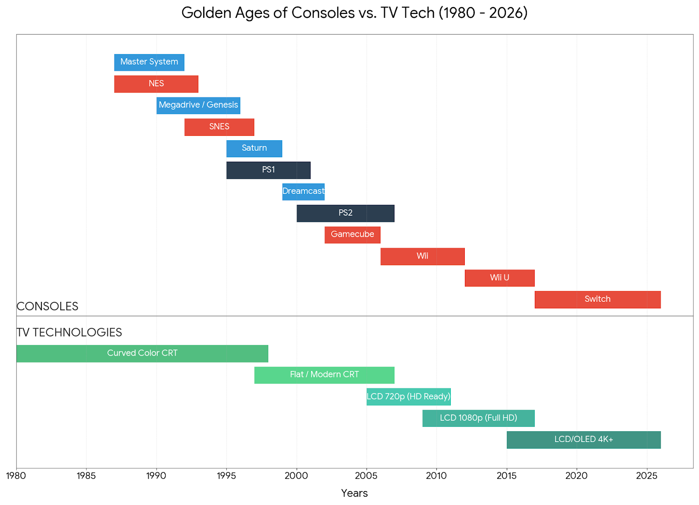

# Install notes for the Retroid Pocket 6 handheld console

> Many things from my [RPM Install](https://github.com/gerpy/rpm-install) still stand. Changes mostly come from the larger, 16/9, 1080p and 120Hz screen.



## Standalone emulators shaders

Wii is the last console for which it makes sense to emulate using CRT shaders. So for NetherSX2 and Gamecube, we use the build-in shaders, which are often not fancy, for the better. Scanlines typically make zero sense on such consoles displaying 480p and not 224p or 240p. Only TV consoles are discussed here.

### Dolphin

Built-in shaders don't help much. Clownacy has ported GLSL shaders for the standalone Dolphin emulator:  
https://clownacy.wordpress.com/2023/06/30/porting-crt-shaders-from-retroarch-to-dolphin/. The latest versions are found in this repo: https://github.com/dolphin-emu/dolphin/tree/master/Data/Sys/Shaders/.

The shaders are `crt-pi.glsl` and `crt-lottes-fast.glsl`. They are supposed to expose parameters to the Dolphin UI, but Dolphin on Android lacks the parameters tweaking feature as on Windows. Therefore, the shaders need manual edits of default values for optimal rendering.

Scanlines produce a lot of moiré/banding artifacts on the RPM, to the point that the shaders become unusable. There shouldn't be visible scanlines at all for GameCube 480p content. To remove scanlines as well as curvature, the shaders need to be modified in an editor by changing their default values. These are modified **`crt-lottes-fast.glsl`** :

- With **mask #1** (aperture grille) : [crt_lottes_fast_mask1.glsl](https://github.com/gerpy/rpm-install/blob/main/Dolphin%20Shaders/crt_lottes_fast_mask1.glsl)

- With **mask #3** (shadow mask) : [crt_lottes_fast_mask3.glsl](https://github.com/gerpy/rpm-install/blob/main/Dolphin%20Shaders/crt_lottes_fast_mask3.glsl)

Shadow masks do a better job at smoothing while Aperture grilles produce a sharper image. I chose **mask #2** here. The `crt-pi.glsl` mask is just an aperture grille with scanlines, without added value over `crt-lottes-fast.glsl` IMO.

### NetherSx2

The built-in Triangle and Lottes shaders scale well. Others produce banding/moiré artifacts. I choose **`Lottes`**, which resembles Dolphin's mask #2.

## RetroArch

### LCD Shaders

Based on my testing, the ```simpletex_lcd.slang``` shader performs excellently with non-integer scaling (to maximize the gameplay area). While the default settings aren't strictly realistic, they provide a very pleasing aesthetic. Since there are no built-in options to simulate the specific colorimetry of each handheld, this must be handled at the core level. Although dedicated shaders exist for this purpose, they would require creating a separate preset for every console.

In the provided presets, motion blur is handled by ```response-time.slang``` to take full advantage of 120Hz displays. Consequently, any similar options in the core should be disabled. To ensure perfect pixel geometry without introducing shimmering during scrolling, I have placed ```sharp-shimmerless.slang``` at the beginning of the shader chain.

I have created two primary presets:
- [lcd-nolit.glsl](shaders/lcd-nolit.slangp) designed for consoles like the original Game Boy, which feature non-backlit reflective screens
- [lcd-backlit.glsl](shaders/lcd-backlit.slangp) designed for consoles like the GBA (SP/Micro), which utilize backlit displays

For the backlit static parameters, use the following settings as a baseline:

| **Parameter**            | **GBA**               | **DS**              | **PSP**                 |
| ------------------------ | --------------------- | ------------------- | ----------------------- |
| **Grid Intensity**       | **0.40**              | **0.25**            | **0.15**                |
| **Grid Width**           | **0.50**              | **0.40**            | **0.20**                |
| **Darken Colours**       | **0.20**              | **0.15**            | **0.10**                |
| **Darken Grid**          | **1.00**              | **1.00**            | **1.00**                |
| **Background Intensity** | **0.00**              | **0.00**            | **0.00**                |

When it comes to remanence, I would recommend :

| **System**        | **LCD Response Time** |
| ------------------ | ---------------------- |
| **Game Boy (GB)**  | **0.67**               |
| **Game Boy Color** | **0.44**               |
| **GBA (Moyenne)**  | **0.33**               |
| **Nintendo DS**    | **0.22**               |
| **PSP**            | **0.33**               |

### CRT Shaders

For CRT-based consoles, the Guest shader suite provides the optimal baseline. Given a 1080p handheld display, the "Fast" version is sufficient and prioritizes battery life. The core reference is crt-guest-advanced-fast.slangp.

Two preset families were developed:
- Static-only: Focused strictly on mask structure and scanlines.
- Motion-enhanced: Identical logic but incorporating a crt-beam-simulator pass to improve motion clarity on 120Hz displays.

The following engineering constraints were maintained:
- Non-integer scaling at 1080p: Artifact-free performance across various source resolutions.
- Minimalist processing: Strictly limited to a shadow mask (for dithering treatment) and scanlines where applicable.
- Color accuracy: Colorimetry remains consistent with the raw, unshaded output.

The scanline strategy involves widening the gaps between lines—including in bright areas—to mitigate scaling artifacts. To preserve overall luminance, the scanline intensity is slightly increased (lighter blacks).


## RetroArch CRT shaders

This discussion focuses exclusively on home consoles. We are targeting shaders for the Dreamcast and earlier generations. While scanlines don’t really make sense for the Dreamcast, they are essential for older systems. However, shadow masks are relevant for every console because they 'upscale' pixels correctly, introducing more detail and color depth.

We’ve selected crt-guest-advanced-fast for its flexibility and excellent handling of non-integer scaling (as I prefer a full-height display). The 'fast' version is more than adequate; it helps conserve battery life while reducing heat and fan noise. I also pair it with crt-beam-simulator to leverage the 120Hz screen without darkening the display as much as standard Black Frame Insertion (BFI) would.

Early 3D consoles like the N64 or PS1 are often thought to look better with internal resolution upscaling. In my opinion, multipliers beyond 2x look terribly imbalanced, but letting the core upscale to 480p is acceptable. However, to achieve this while maintaining the intended scanline effect, the shader preset requires a few specific tweaks.

> The following is Gemini's

### Comprehensive CRT Calibration for 1080p OLED Handhelds

This finalized configuration is designed for a handheld console (1080p OLED, 5.5", 120Hz). It combines the temporal motion clarity of **crt-beam-simulator** (Pass 0) with the spatial signal granularity of **crt-guest-advanced-fast** (Main Pass). The settings ensure absolute robustness against **non-integer scaling**, atypical **Arcade PAR**, and aggressive **overscan crops**.

### Spatial-only shader

This shader must be **prepended** (placed at the top of the shader list) to simulate the electron gun's temporal behavior.
*Requirement: Set "Shader Sub-frames" to **2** in RetroArch Settings > Video > Synchronization.*

The following tables show only the parameters that have been modified compared to the default values. 
Parameters highlighted in **bold** are those that differ between the 1x and 2x versions.

#### Mode 1x without beam : Native Resolution Configuration (NES, SNES, Genesis, DC)

*Note: Dreamcast (480p) is handled via the Interlace Trigger to ensure a solid high-resolution image without flickering.*

[CRT-1x-Shadow](https://github.com/gerpy/rp6-install/blob/main/shaders/crt-1x-shadow.slangp)

| Section | Parameter (UI Label) | Default | 1x Value | Explanation |
| :--- | :--- | :--- | :--- | :--- |
| [ GAMMA OPTIONS ] | Gamma out | 2.40 | 2.20 | Adjusts the output color curve for standard displays. |
| [ FILTERING OPTIONS ] | **Horizontal sharpness** | 5.20 | **3.50** | Controls the sharpness of pixel transitions on the X axis. |
| [ FILTERING OPTIONS ] | **Substractive sharpness** | 0.50 | **1.50** | Enhances edge definition; higher values result in sharper pixels. |
| [ FILTERING OPTIONS ] | Substractive sharpness Ringing | 0.00 | 0.50 | Adds a slight outline effect to sharp transitions. |
| [ SCREEN OPTIONS ] | Curvature Shape | 0.25 | 0.05 | Modifies the geometry of the simulated CRT curvature. |
| [ BRIGHTNESS SETTINGS ] | Mask Bloom | 0.00 | 0.70 | Simulates light bleeding from the phosphor mask. |
| [ BRIGHTNESS SETTINGS ] | Bright Boost Dark Pixels | 1.40 | 1.60 | Increases visibility in dark areas to counteract mask darkening. |
| [ BRIGHTNESS SETTINGS ] | Bright Boost Bright Pixels | 1.10 | 1.20 | Slightly increases brightness in highlights. |
| [ SCANLINE OPTIONS ] | Scanline Type | 0.00 | 15.00 | Selects the beam profile for the horizontal lines. |
| [ SCANLINE OPTIONS ] | Scanline Beam Shape Edges | 8.00 | 0.90 | Controls the softness of the scanline edges. |
| [ SCANLINE OPTIONS ] | Scanline Falloff | 1.00 | 0.70 | Adjusts the light distribution within the scanline. |
| [ CRT MASK OPTIONS ] | CRT Mask | 0.00 | 6.00 | Selects the "Shadow Mask" phosphor structure. |
| [ CRT MASK OPTIONS ] | Mask Strength (0, 5-12) | 0.30 | 0.85 | Sets the overall opacity of the CRT phosphor grid. |
| [ CRT MASK OPTIONS ] | Mask Layout: RGB or BGR | 0.00 | 1.00 | Sets the sub-pixel arrangement for the mask. |
| [ CRT MASK OPTIONS ] | Slot Mask Strength | 0.00 | 0.65 | Sets the intensity of the vertical slot pattern. |
| [ CRT MASK OPTIONS ] | Slot Mask Width | 0.00 | 3.00 | Defines the width of the slot mask pattern. |
| [ CRT MASK OPTIONS ] | Smooth Masks in bright scanlines | 0.00 | 1.00 | Softens the mask pattern in high-luminance areas. |
| [ CRT MASK OPTIONS ] | Mitigate Slotmask Interaction | 0.00 | 1.00 | Reduces moiré artefacts between mask and scanlines. |
| [ DECONVERGENCE ] | Post Brightness | 1.00 | 1.40 | Final brightness multiplier applied to the image. |

#### Mode 2x without beam : Core 2x Upscaled Configuration (PS1, N64)

*Forces 240p-style thick scanlines and signal granularity on a 480p internal core buffer.*

[CRT-2x-Shadow](https://github.com/gerpy/rp6-install/blob/main/shaders/crt-2x-shadow.slangp)

| Section | Parameter (UI Label) | Default | 2x Value | Explanation |
| :--- | :--- | :--- | :--- | :--- |
| [ GAMMA OPTIONS ] | Gamma out | 2.40 | 2.20 | Standardizes the output gamma. |
| [ INTERLACING OPTIONS ] | **Interlace Trigger Resolution** | 375.0 | **600.0** | Threshold for activating interlacing logic. |
| [ INTERLACING OPTIONS ] | **Interlace Mode** | 1.00 | **4.00** | Changes the field rendering method for interlaced content. |
| [ INFO --> Internal Res ] | **Internal Resolution Y** | 0.00 | **2.00** | Doubles the vertical internal resolution (Supersampling). |
| [ FILTERING OPTIONS ] | **Horizontal sharpness** | 5.20 | **2.50** | Softer than 1x to accommodate the higher resolution. |
| [ FILTERING OPTIONS ] | Substractive sharpness Ringing | 0.00 | 0.50 | Adds haloing to sharp transitions. |
| [ FILTERING OPTIONS ] | **Scanline Spike Removal** | 1.00 | **1.50** | Filters out harsh brightness spikes in scanlines. |
| [ SCREEN OPTIONS ] | Curvature Shape | 0.25 | 0.05 | Flattened curvature profile. |
| [ BRIGHTNESS SETTINGS ] | Mask Bloom | 0.00 | 0.70 | Light bleeding on the phosphor mask. |
| [ BRIGHTNESS SETTINGS ] | Bright Boost Dark Pixels | 1.40 | 1.60 | Compensation for dark area loss. |
| [ BRIGHTNESS SETTINGS ] | Bright Boost Bright Pixels | 1.10 | 1.20 | Highlight boost. |
| [ SCANLINE OPTIONS ] | Scanline Type | 0.00 | 15.00 | Profile of the scanline. |
| [ SCANLINE OPTIONS ] | Scanline Beam Shape Edges | 8.00 | 0.90 | Edge definition of the beam. |
| [ SCANLINE OPTIONS ] | Scanline Falloff | 1.00 | 0.70 | Taper of the beam. |
| [ CRT MASK OPTIONS ] | CRT Mask | 0.00 | 6.00 | Shadow Mask selection. |
| [ CRT MASK OPTIONS ] | Mask Strength (0, 5-12) | 0.30 | 0.85 | Overall grid intensity. |
| [ CRT MASK OPTIONS ] | Mask Layout: RGB or BGR | 0.00 | 1.00 | Sub-pixel orientation. |
| [ CRT MASK OPTIONS ] | Slot Mask Strength | 0.00 | 0.65 | Intensity of the vertical pattern. |
| [ CRT MASK OPTIONS ] | Slot Mask Width | 0.00 | 3.00 | Width of the slot pattern. |
| [ CRT MASK OPTIONS ] | Smooth Masks in bright scanlines | 0.00 | 1.00 | Localized smoothing in highlights. |
| [ CRT MASK OPTIONS ] | Mitigate Slotmask Interaction | 0.00 | 1.00 | Artefact mitigation. |
| [ DECONVERGENCE ] | Post Brightness | 1.00 | 1.40 | Final brightness gain. |

### Temporal Integration with CRT Beam Simulator (Pass 0)

These versions introduce a Beam Simulator (BFI/Subframe) pass as the first shader stage (shader0). In the tables below, values in bold represent parameters that either differ between the 1x and 2x beam versions or differ from the previous non-beam versions (where post_br was lower and beam parameters were absent).

#### Mode 1x with beam : Native Resolution Configuration (NES, SNES, Genesis, DC)

*Note: Dreamcast (480p) is handled via the Interlace Trigger to ensure a solid high-resolution image without flickering.*

[CRT-1x-Beam-Shadow](https://github.com/gerpy/rp6-install/blob/main/shaders/crt-1x-beam-shadow.slangp)

| Section | Parameter (English Label) | Default | 1x-Beam Value | Explanation |
| :--- | :--- | :--- | :--- | :--- |
| [ BEAM SIMULATOR ] | **Gain vs Blur** | N/A | **0.650000** | [cite_start]New parameter: Adjusts the trade-off between brightness gain and motion blur[cite: 21]. |
| [ BEAM SIMULATOR ] | **LCD Anti-Retention Toggle** | N/A | **0.000000** | [cite_start]New parameter: Toggles a mechanism to prevent LCD image retention during BFI[cite: 21]. |
| [ BEAM SIMULATOR ] | **Scan Direction** | N/A | **0.000000** | [cite_start]New parameter: Defines the direction of the simulated electron beam sweep[cite: 21]. |
| [ GAMMA OPTIONS ] | Gamma out | 2.40 | 2.20 | Adjusts the output luminance curve. |
| [ FILTERING OPTIONS ] | **Horizontal sharpness** | 5.20 | **3.50** | Controls horizontal pixel transitions (differs from 2x version). |
| [ FILTERING OPTIONS ] | **Substractive sharpness** | 0.50 | **1.50** | Enhances edge definition (active in 1x version only). |
| [ FILTERING OPTIONS ] | Substractive sharpness Ringing | 0.00 | 0.50 | Adds a slight halo effect to transitions. |
| [ SCREEN OPTIONS ] | Curvature Shape | 0.25 | 0.05 | Flattened CRT curvature geometry. |
| [ BRIGHTNESS SETTINGS ] | Mask Bloom | 0.00 | 0.70 | Light bleeding on the phosphor mask. |
| [ BRIGHTNESS SETTINGS ] | Bright Boost Dark Pixels | 1.40 | 1.60 | Visibility boost for dark areas. |
| [ BRIGHTNESS SETTINGS ] | Bright Boost Bright Pixels | 1.10 | 1.20 | Highlight brightness boost. |
| [ SCANLINE OPTIONS ] | Scanline Type | 0.00 | 15.00 | Selection of the beam profile. |
| [ SCANLINE OPTIONS ] | Scanline Beam Shape Edges | 8.00 | 0.90 | Softness of the scanline boundaries. |
| [ SCANLINE OPTIONS ] | Scanline Falloff | 1.00 | 0.70 | Light taper within the scanline. |
| [ CRT MASK OPTIONS ] | CRT Mask | 0.00 | 6.00 | Shadow Mask phosphor type selection. |
| [ CRT MASK OPTIONS ] | Mask Strength | 0.30 | 0.85 | Intensity of the phosphor grid. |
| [ CRT MASK OPTIONS ] | Mask Layout | 0.00 | 1.00 | Sub-pixel orientation (RGB/BGR). |
| [ CRT MASK OPTIONS ] | Slot Mask Strength (Br/Dk) | 0.00 | 0.65 | Intensity of the vertical slot pattern. |
| [ CRT MASK OPTIONS ] | Slot Mask Width | 0.00 | 3.00 | Width of the slot cells. |
| [ CRT MASK OPTIONS ] | Smooth Masks in bright scanlines | 0.00 | 1.00 | Lissage in high-brightness areas. |
| [ CRT MASK OPTIONS ] | Mitigate Slotmask Interaction | 0.00 | 1.00 | Reduces pattern interference. |
| [ DECONVERGENCE / POST ] | **Post Brightness** | 1.00 | **1.5** | Final brightness gain (increased vs. previous non-beam versions). |

#### Mode 2x with beam : Core 2x Upscaled Configuration (PS1, N64)

*Forces 240p-style thick scanlines and signal granularity on a 480p internal core buffer.*

[CRT-2x-Beam-Shadow](https://github.com/gerpy/rp6-install/blob/main/shaders/crt-2x-beam-shadow.slangp)

| Section | Parameter (English Label) | Default | 2x-Beam Value | Explanation |
| :--- | :--- | :--- | :--- | :--- |
| [ BEAM SIMULATOR ] | **Gain vs Blur** | N/A | **0.650000** | [cite_start]New parameter: Trade-off between brightness and motion clarity[cite: 24]. |
| [ BEAM SIMULATOR ] | **LCD Anti-Retention Toggle** | N/A | **0.000000** | [cite_start]New parameter: Prevents image sticking on modern panels[cite: 24]. |
| [ BEAM SIMULATOR ] | **Scan Direction** | N/A | **0.000000** | [cite_start]New parameter: Beam sweep direction[cite: 24]. |
| [ GAMMA OPTIONS ] | Gamma out | 2.40 | 2.20 | Output luminance curve adjustment. |
| [ INTERLACING OPTIONS ] | **Interlace Trigger Resolution** | 375.0 | **600.00** | Resolution threshold (active in 2x version only). |
| [ INTERLACING OPTIONS ] | **Interlace Mode** | 1.00 | **4.00** | Field handling method (differs from 1x version). |
| [ INFO --> Internal Res ] | **Internal Resolution Y** | 0.00 | **2.00** | Vertical supersampling (active in 2x version only). |
| [ FILTERING OPTIONS ] | **Horizontal sharpness** | 5.20 | **2.50** | Softer transitions to balance high-res scaling. |
| [ FILTERING OPTIONS ] | Substractive sharpness Ringing | 0.00 | 0.50 | Adds haloing to sharp edges. |
| [ FILTERING OPTIONS ] | **Scanline Spike Removal** | 1.00 | **1.50** | Filters harsh brightness peaks (differs from 1x version). |
| [ SCREEN OPTIONS ] | Curvature Shape | 0.25 | 0.05 | Flattened screen profile. |
| [ BRIGHTNESS SETTINGS ] | Mask Bloom | 0.00 | 0.70 | Phosphor mask light diffusion. |
| [ BRIGHTNESS SETTINGS ] | Bright Boost Dark Pixels | 1.40 | 1.60 | Compensation for dark details. |
| [ BRIGHTNESS SETTINGS ] | Bright Boost Bright Pixels | 1.10 | 1.20 | Highlight boost. |
| [ SCANLINE OPTIONS ] | Scanline Type | 0.00 | 15.00 | Horizontal beam profile. |
| [ SCANLINE OPTIONS ] | Scanline Beam Shape Edges | 8.00 | 0.90 | Scanline edge sharpness. |
| [ SCANLINE OPTIONS ] | Scanline Falloff | 1.00 | 0.70 | Beam light taper. |
| [ CRT MASK OPTIONS ] | CRT Mask | 0.00 | 6.00 | Shadow Mask grid selection. |
| [ CRT MASK OPTIONS ] | Mask Strength | 0.30 | 0.85 | Phosphor grid opacity. |
| [ CRT MASK OPTIONS ] | Mask Layout | 0.00 | 1.00 | RGB/BGR orientation. |
| [ CRT MASK OPTIONS ] | Slot Mask Strength (Br/Dk) | 0.00 | 0.65 | Slot pattern intensity. |
| [ CRT MASK OPTIONS ] | Slot Mask Width | 0.00 | 3.00 | Cell width. |
| [ CRT MASK OPTIONS ] | Smooth Masks in bright scanlines | 0.00 | 1.00 | Localized smoothing. |
| [ CRT MASK OPTIONS ] | Mitigate Slotmask Interaction | 0.00 | 1.00 | Artefact reduction. |
| [ DECONVERGENCE / POST ] | **Post Brightness** | 1.00 | **1.5** | Final brightness gain (increased vs. previous non-beam versions). |
