# Install notes for the Retroid Pocket 6 handheld console

> Many things from my [RPM Install](https://github.com/gerpy/rpm-install) still stand. Changes mostly come from the larger, 16/9, 1080p and 120Hz screen.

## Standalone emulators shaders

Wii is the last console for which it makes sense to emulate using CRT shaders. So for NetherSX2 and Gamecube, we use the build-in shaders, which are often not fancy, for the better. Scanlines typically make zero sense on such consoles displaying 480p and not 224p or 240p. Only TV consoles are discussed here.

### Dolphin

Built-in shaders don't help much. Clownacy has ported GLSL shaders for the standalone Dolphin emulator:  
https://clownacy.wordpress.com/2023/06/30/porting-crt-shaders-from-retroarch-to-dolphin/. The latest versions are found in this repo: https://github.com/dolphin-emu/dolphin/tree/master/Data/Sys/Shaders/.

The shaders are `crt-pi.glsl` and `crt-lottes-fast.glsl`. They are supposed to expose parameters to the Dolphin UI, but Dolphin on Android lacks the parameters tweaking feature as on Windows. Therefore, the shaders need manual edits of default values for optimal rendering.

Scanlines produce a lot of moiré/banding artifacts on 1080p screens, to the point that the shaders become unusable. There shouldn't be visible scanlines at all for GameCube 480p content. To remove scanlines as well as curvature, the shaders need to be modified in an editor by changing their default values. These are modified **`crt-lottes-fast.glsl`** :

- With **mask #1** (aperture grille) : [crt_lottes_fast_mask1.glsl](https://github.com/gerpy/rpm-install/blob/main/Dolphin%20Shaders/crt_lottes_fast_mask1.glsl)

- With **mask #3** (shadow mask) : [crt_lottes_fast_mask3.glsl](https://github.com/gerpy/rpm-install/blob/main/Dolphin%20Shaders/crt_lottes_fast_mask3.glsl)

Shadow masks do a better job at smoothing while Aperture grilles produce a sharper image. I chose **mask #2** here. The `crt-pi.glsl` mask is just an aperture grille with scanlines, without added value over `crt-lottes-fast.glsl` IMO.

### NetherSx2

The built-in Triangle and Lottes shaders scale well. Others produce banding/moiré artifacts. I choose **`Lottes`**, which resembles Dolphin's mask #2.

## RetroArch

### LCD Shaders

#### Global approach

Based on my testing, the ```simpletex_lcd.slang``` shader performs excellently with non-integer scaling (to maximize the gameplay area). While the default settings aren't strictly realistic, they provide a very pleasing aesthetic. Since there are no built-in options to simulate the specific colorimetry of each handheld, this must be handled at the core level. Although dedicated shaders exist for this purpose, they would require creating a separate preset for every console.

In the provided presets, motion blur is handled by ```response-time.slang``` to take full advantage of 120Hz displays. Consequently, any similar options in the core should be disabled.

#### Files

I have created 3 primary presets:
- [lcd-native-nolit.glsl](shaders/lcd-native-nolit.slangp) designed for consoles like the original Game Boy, which feature non-backlit reflective screens
- [lcd-native-backlit.glsl](shaders/lcd-native-backlit.slangp) designed for consoles like the GBA (SP/Micro), which utilize backlit displays
- [lcd-ssaa2x-backlit.glsl](shaders/lcd-ssaa2x-backlit.slangp) designed for 3D consoles like the PSP. This shader expects a x2 rendering from the core and downsamples to native resolution before rendering so a to antialias.

#### Samples

| 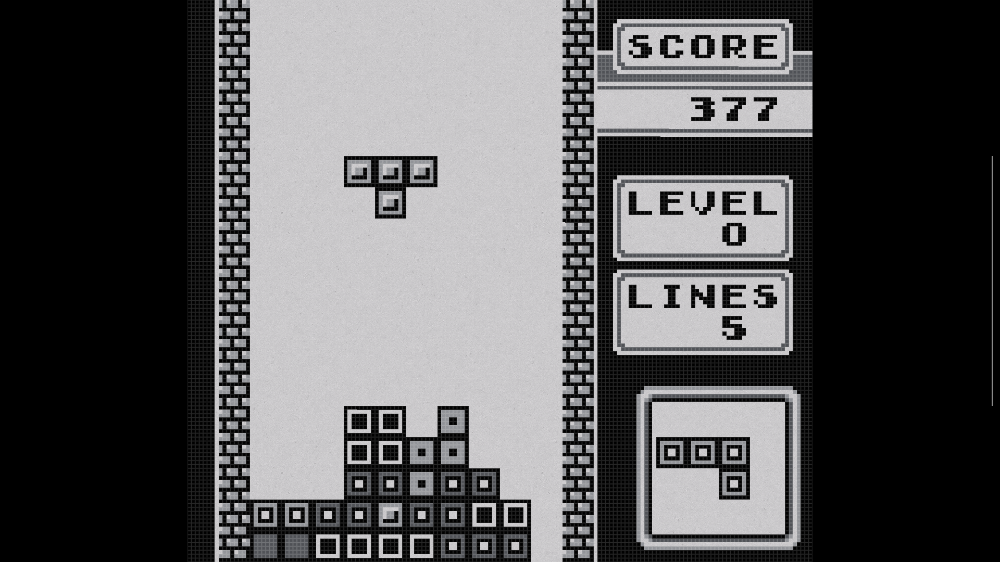 | 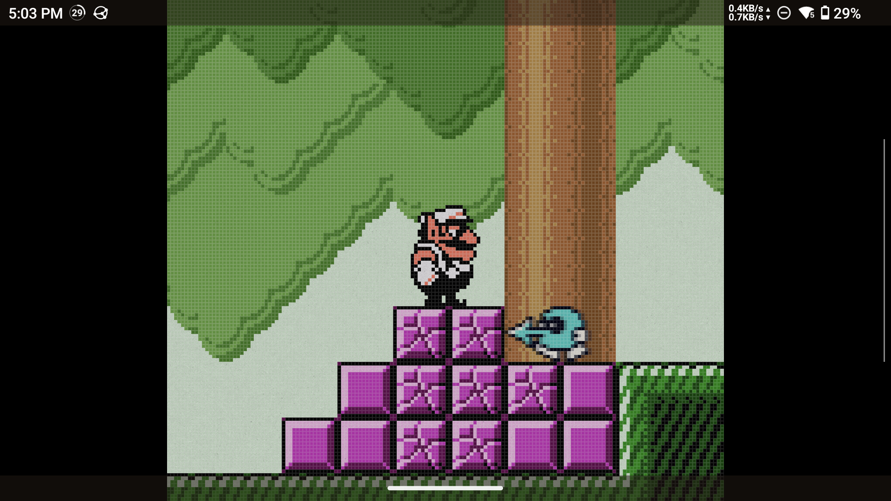 | 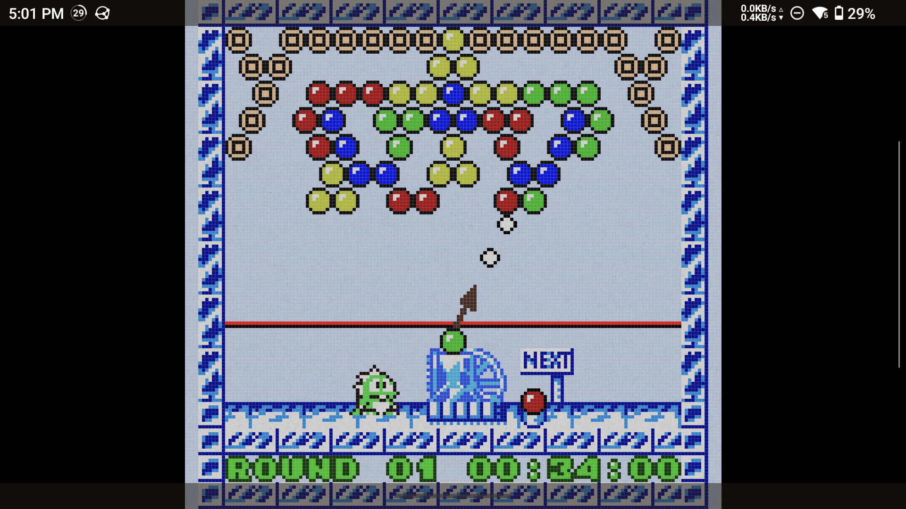 | 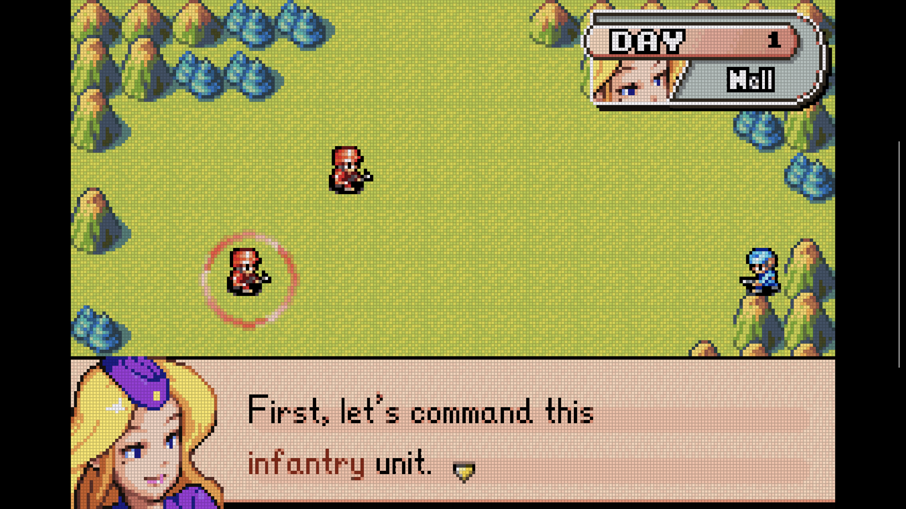 |
| :---: | :---: | :---: | :---: |
| 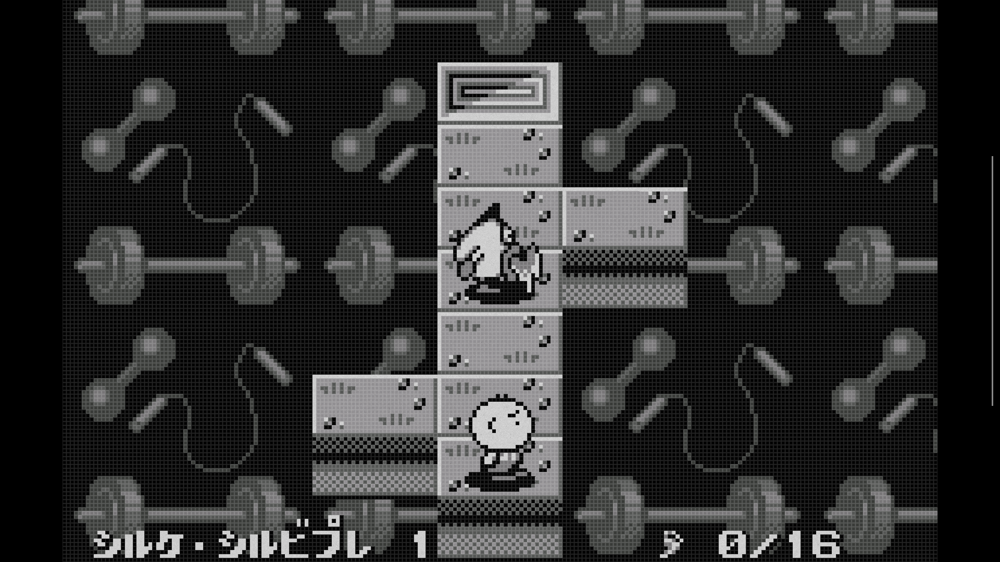 | 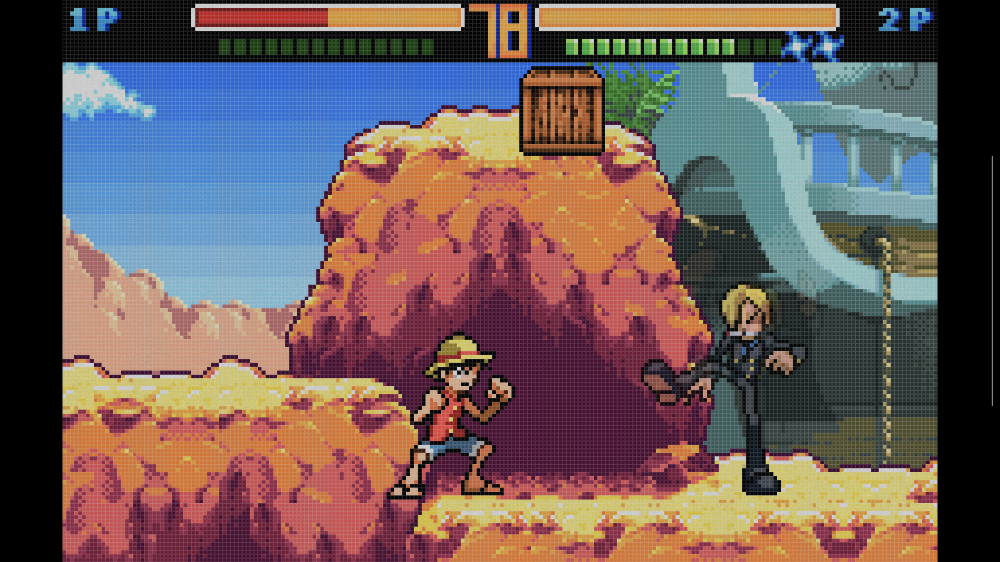 | 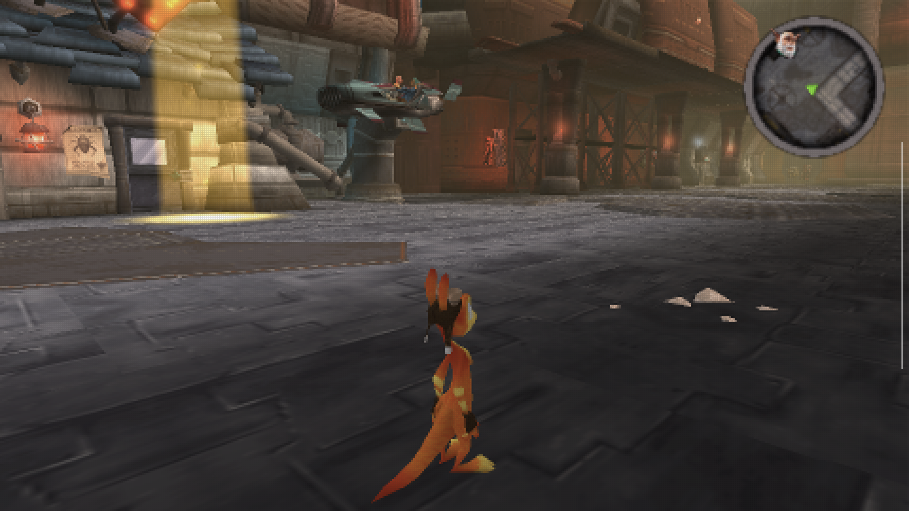 | |

There are shaders that alter colorimetry to match specific consoles. Theses shaders might ne prepened to my shaders. Some cores also manage palettes or color simulations. Either use one or the other solution, not both.

For the backlit static parameters, use the following settings as a baseline:

| **Parameter**            | **GBA**               | **DS**              | **PSP**                 |
| ------------------------ | --------------------- | ------------------- | ----------------------- |
| **Grid Intensity**       | **0.40**              | **0.25**            | **0.15**                |
| **Grid Width**           | **0.50**              | **0.40**            | **0.20**                |
| **Darken Colours**       | **0.20**              | **0.15**            | **0.10**                |
| **Darken Grid**          | **1.00**              | **1.00**            | **1.00**                |
| **Background Intensity** | **0.00**              | **0.00**            | **0.00**                |

When it comes to remanence, I would recommend :

| **System**        | **LCD Response Time** |
| ------------------ | ---------------------- |
| **Game Boy (GB)**  | **0.67**               |
| **Game Boy Color** | **0.44**               |
| **GBA (Moyenne)**  | **0.33**               |
| **Nintendo DS**    | **0.22**               |
| **PSP**            | **0.33**               |


### CRT Shaders

#### Global approach

The Hyllian CRT shader provides the optimal baseline to me : efficient, non-integer scaling proof and not as many parameters as Guest. For GLSL shaders, I use the 3D variant because the regular one won't load on my RA install. We mostly loose the BRG subpixels od the OLED but Hyllian CRT doesn't separate colors very much so no worry.

Two preset families were developed:
- Static-only: Focused strictly on mask structure and scanlines.
- Motion-enhanced (SLANG only, with **```beam```** in the shader filename): identical logic but incorporating a crt-beam-simulator pass to improve motion clarity on 120Hz displays.

The following engineering constraints were maintained:
- Non-integer scaling at 1080p: Artifact-free performance across various source resolutions. I use the mask #4 on everythong with scanlines. Without scanlines, the #17 is just fine to me.
- Color accuracy: Colorimetry remains mostly consistent with the raw, unshaded output.

#### Core resolution enhancements

Furthermore, I dislike the "clinical" look of legacy 3D games rendered at ultra-high resolutions; I find the imbalance between low-fidelity textures/polygons and high-precision rendering to be jarring. Consequently, my policy has been to create:

- **```Native``` presets designed for ```1x``` core output**, allowing the Hyllian shader to handle "organic" interpolation via masks and scanlines (intended for Arcade, SNES, etc.).
- **```SSAA2x``` presets for 3D consoles (PS1, N64)** rendered at ```2x``` by the core and then downscaled (softer Bicubic) before beeing processed by Hyllian to add scanlines matching the native vertical resolution.

#### Shader files

All the shaders are available here : [shaders](shaders)

#### Samples

| 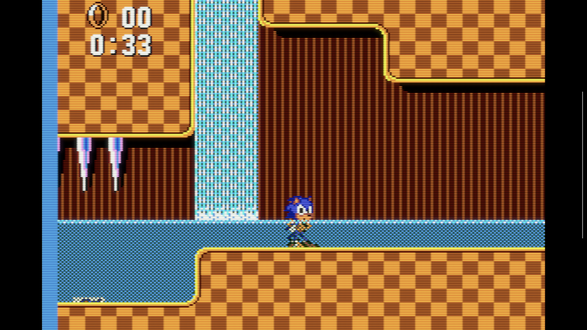 | 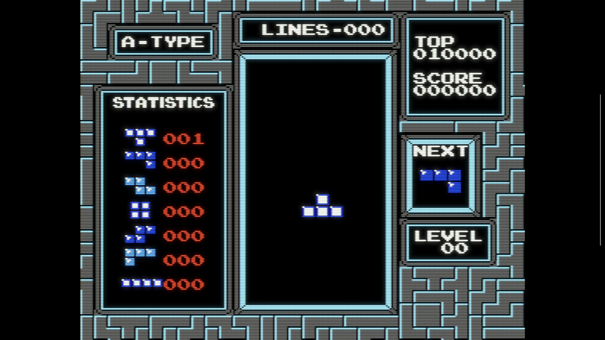 | 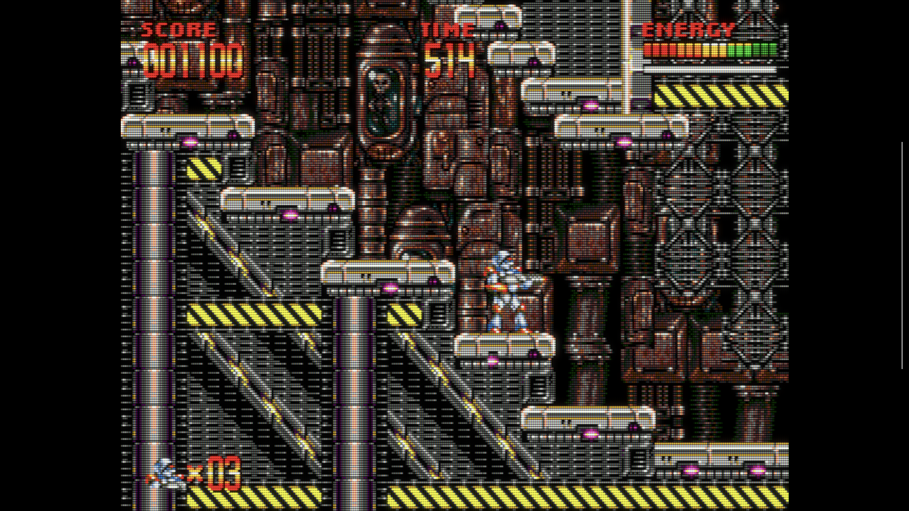 |
| :---: | :---: | :---: |
| 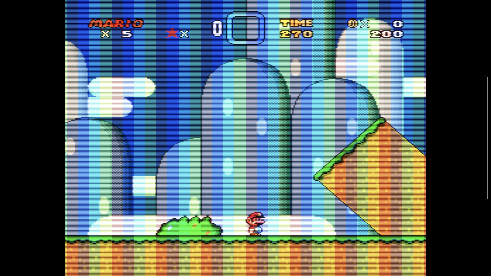 | 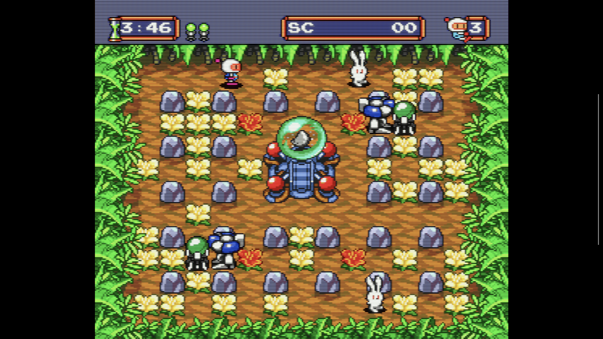 | 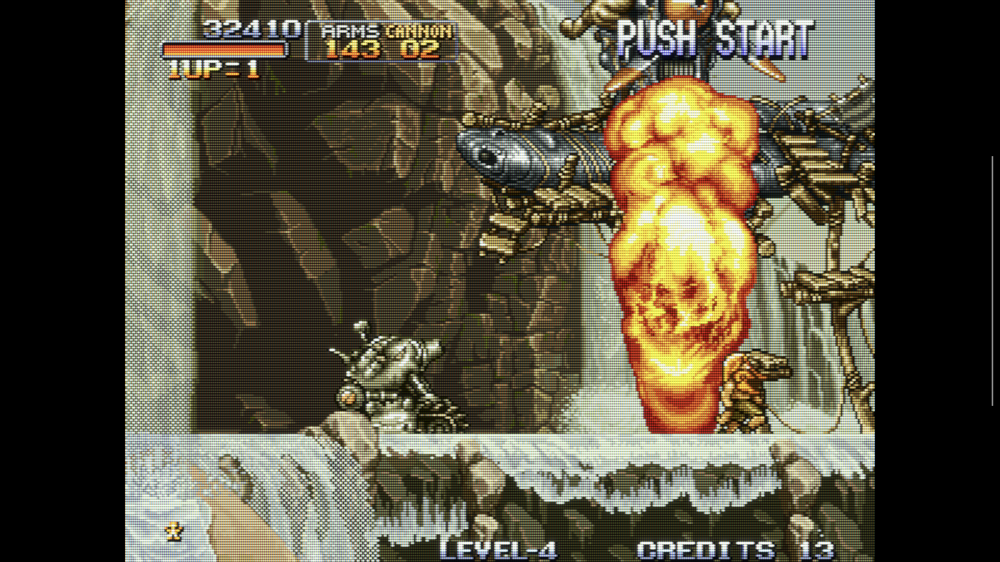 |
| 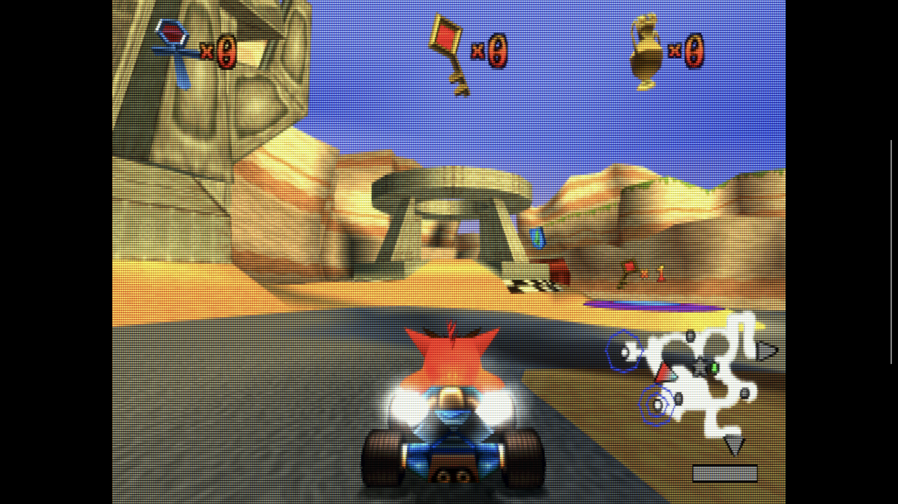 | 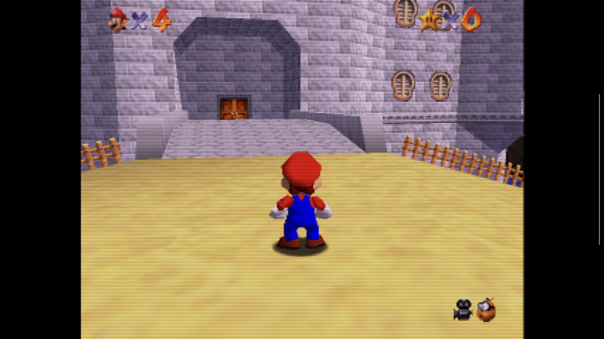 | 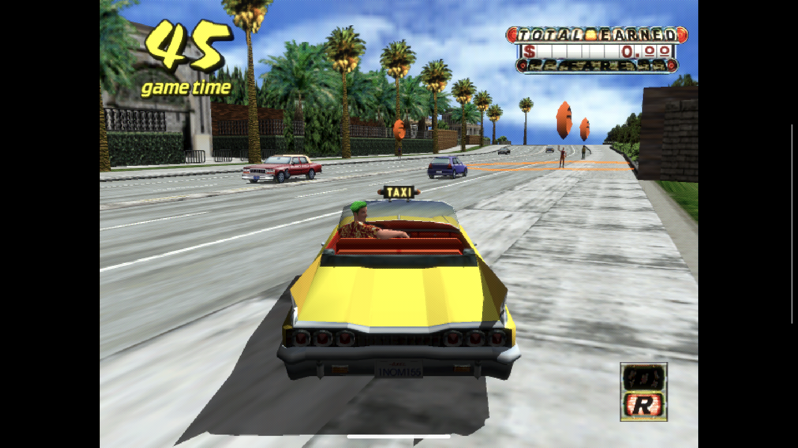 |
